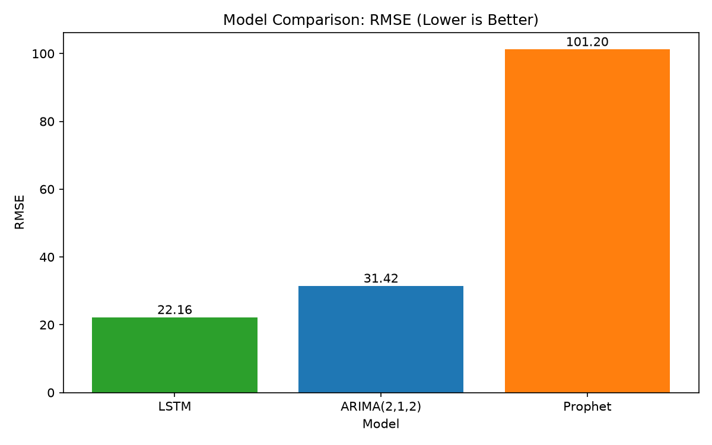

# 📈 MSFT Stock Price Forecasting

Comparing classical statistical models and deep learning for time-series stock price forecasting — built as part of an end-to-end ML/AI project portfolio.

🔗 **Live Dashboard:** _add your deployed Streamlit link here once hosted_
👤 **Author:** Kunj Agarwal — [GitHub](https://github.com/kunjagarwal-dev) · [LinkedIn](https://www.linkedin.com/in/kunjagarwal)

---

## Overview

This project forecasts Microsoft (MSFT) daily closing prices using 5 years of historical data, comparing three fundamentally different modeling approaches:

- **ARIMA** — classical statistical time-series model
- **Prophet** — Meta's automatic trend/seasonality decomposition model
- **LSTM** — deep learning sequence model (PyTorch/TensorFlow)

The goal wasn't just to build three models, but to understand **why** each one succeeds or fails on financial data — and to benchmark all three against a naive random-walk baseline.

---

## Results

| Rank | Model | RMSE |
|------|-------|------|
| 🥇 | **LSTM** | **22.16** |
| 🥈 | ARIMA(2,1,2) | 31.42 |
| 🥉 | Prophet | 101.20 |



**Key finding:** LSTM achieved the lowest error, but visual inspection shows it partially "tracks" recent trend with a slight lag rather than genuinely predicting sharp reversals — a known behavior for LSTMs on near-random-walk financial series. ARIMA's best fit turned out to be very close to a pure random walk (`p=0, q=0` showed no meaningful improvement over baseline), consistent with the Efficient Market Hypothesis. Prophet underperformed significantly, since it's designed for data with strong seasonal patterns — which daily stock prices lack.

---

## Methodology

### 1. Data Collection
- Source: Yahoo Finance via `yfinance`
- Range: 5 years of daily OHLCV data for MSFT
- Cleaned: timezone-normalized datetime index, verified zero nulls

### 2. Exploratory Data Analysis
- Daily returns (`pct_change`)
- 30-day and 200-day moving averages
- 30-day rolling volatility

### 3. ARIMA
- Augmented Dickey-Fuller (ADF) test confirmed non-stationarity (p-value: 0.74)
- First-order differencing achieved stationarity (p-value: ~0.000)
- ACF/PACF analysis showed no significant autocorrelation beyond lag 0
- Compared ARIMA(0,1,0), (1,1,1), (2,1,2) by RMSE and AIC

### 4. Prophet
- Reformatted data into Prophet's required `ds`/`y` format
- Fit with default trend + seasonality settings
- Evaluated on the same held-out test window as ARIMA

### 5. LSTM
- MinMax-scaled closing prices
- 60-day sliding window sequences
- 2-layer LSTM (50 units each) with dropout regularization
- Trained on Google Colab (TensorFlow/Keras) due to local environment constraints
- Inverse-transformed predictions back to price scale for fair RMSE comparison

### 6. Evaluation
- Consistent 90/10 train/test split (chronological, not shuffled) across all models
- RMSE as the primary comparison metric
- Visual predicted-vs-actual plots for qualitative inspection

---

## Project Structure

```
stock-price-forecasting/
├── data/
│   ├── raw/                    # original MSFT.csv
│   └── processed/              # lstm_predictions.csv
├── notebooks/
│   ├── 01_data_collection.ipynb
│   ├── 02_eda.ipynb
│   ├── 03_arima_model.ipynb
│   ├── 04_prophet_model.ipynb
│   ├── 05_lstm_model.ipynb      # run on Google Colab
│   └── 06_comparison.ipynb
├── src/
│   ├── data_loader.py
│   ├── preprocessing.py
│   └── utils.py
├── models/
│   ├── arima_model.pkl
│   ├── prophet_model.pkl
│   └── *_results.json
├── app/
│   └── streamlit_app.py
├── assets/
│   └── rmse_comparison.png
├── requirements.txt
└── README.md
```

---

## Tech Stack

`Python` · `pandas` · `NumPy` · `statsmodels` (ARIMA) · `Prophet` · `TensorFlow/Keras` (LSTM) · `scikit-learn` · `Streamlit` · `Matplotlib`

---

## Running Locally

```bash
# Clone and install dependencies
pip install -r requirements.txt

# Run the dashboard
cd app
streamlit run streamlit_app.py
```

**Note:** The LSTM model was trained on Google Colab due to a local Windows environment conflict with TensorFlow's native DLLs. Predictions are exported as `lstm_predictions.csv` and loaded directly by the app/comparison notebook — no local TensorFlow installation required to view results.

---

## Key Learnings

- Diagnosing stationarity (ADF test) and autocorrelation (ACF/PACF) before model selection, rather than guessing hyperparameters
- Recognizing when a "better" model (Prophet) underperforms because its assumptions don't match the data's structure
- Understanding the difference between low error and genuine predictive signal — LSTM's lower RMSE partly reflects smoothing, not true directional forecasting
- Building a reusable `src/` module structure shared across multiple modeling notebooks
- Working around local environment/dependency constraints by offloading GPU-dependent training to Google Colab